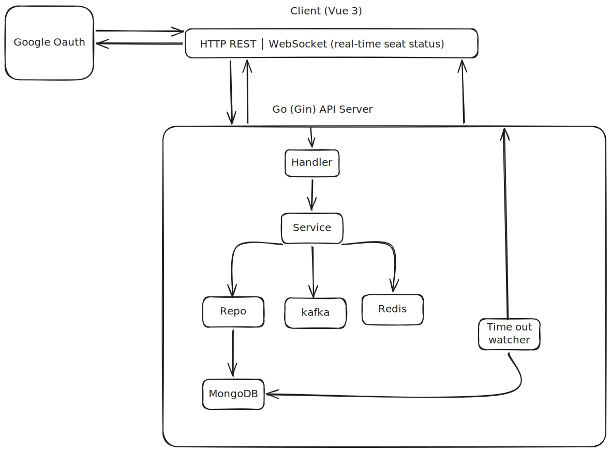

# Cinema Booking System

Real-time seat booking system with distributed locking and event-driven architecture.

---

## 1. System Architecture Diagram



---

## 2. Tech Stack Overview

| Layer | Technology | หน้าที่ |
|---|---|---|
| Frontend | Vue 3 + TypeScript + Pinia | UI, state management |
| Router | Vue Router 4 | Guard หน้า booking ด้วย `meta.requiresAuth` |
| Backend | Go + Gin | REST API |
| Database | MongoDB | Primary data store |
| Cache / Lock | Redis | Distributed seat lock (SetNX + TTL) |
| Message Queue | Kafka | Event streaming (booking success / timeout / seat released) |
| Real-time | WebSocket (Gorilla WebSocket + Custom Hub) | Broadcast seat status ไปหา client ทุกคนทันที |
| Auth | Google OAuth (JWT) | Login ผ่าน Google ID Token |

---

## 3. Booking Flow

1. เลือกหนังที่ต้องการ
ผู้ใช้เลือกหนังที่ต้องการ ก็จะขึ้น รอบฉายของแต่ละโรงหนัง และ มี hall ใดบ้าง

2. เลือกรอบฉายหนัง
ผู้ใช้เลือกรอบฉายหนัง, สาขาโรงภาพยนต์ และ โรงที่ฉาย อาจมี hall1, hall2, สาขาโรงภาพยนต์ และ โรงที่ฉาย อาจมี hall1, hall2

3. เลือกที่นั่ง
ผู้ใช้เลือกที่นั่งที่ต้องการจอง เช่น A1 และ A2 จากการ response ของการเลือกรอบฉายหนัง โดยที่ตรงนี้จะเชื่อมกับ web socket เพื่อเป็น
real time seat map และจะมี status บอกอยู่ว่า ตรงไหนกำลังจองหรือจองไปแล้ว

4. ตรวจสอบและ Lock ที่นั่ง
Backend จะตรวจสอบว่าที่นั่งสามารถจองได้หรือไม่ จากนั้นทำการ Lock ที่นั่งด้วย Redis โดยใช้ SetNX เพื่อป้องกันไม่ให้ผู้ใช้หลายคนจองที่นั่งเดียวกันในเวลาเดียวกัน ที่นั่งจะถูก Lock ไว้ชั่วคราวตาม TTL ที่กำหนด 5 นาที

3. สร้าง Booking เป็น PENDING
เมื่อ Lock ที่นั่งสำเร็จ ระบบจะสร้าง Booking ใน MongoDB โดยมีสถานะเป็น PENDING ซึ่งหมายความว่าผู้ใช้กำลังอยู่ในขั้นตอนการชำระเงิน
ในช่วงนี้ผู้ใช้คนอื่นจะไม่สามารถจองที่นั่งเดียวกันได้

4. ชำระเงิน
ผู้ใช้ดำเนินการชำระเงินภายในเวลาที่กำหนด ขณะที่การชำระเงินกำลังดำเนินการ Redis Lock จะยังคงป้องกันที่นั่งไว้

5. ชำระเงินสำเร็จ
เมื่อชำระเงินสำเร็จ ระบบจะเปลี่ยนสถานะ Booking จาก PENDING เป็น SUCCESS และเปลี่ยนสถานะที่นั่งเป็น BOOKED จากนั้นระบบจะ Release Redis Lock เนื่องจากที่นั่งถูกจองสำเร็จแล้ว

6. ชำระเงินไม่สำเร็จหรือหมดเวลา
หากผู้ใช้ชำระเงินไม่สำเร็จหรือใช้เวลาเกินกำหนด Redis Lock จะหมดอายุโดยอัตโนมัติ ทำให้ที่นั่งสามารถกลับมาถูกจองได้อีกครั้ง
ระบบจะเปลี่ยนสถานะ Booking จาก PENDING เป็น TIMEOUT หรือ FAILED ตามกรณีที่เกิดขึ้น

7. อัปเดตสถานะที่นั่งแบบ Real-time
เมื่อสถานะที่นั่งเปลี่ยน เช่น LOCKED, BOOKED หรือ AVAILABLE ระบบจะส่งข้อมูลผ่าน WebSocket ไปยัง Client เพื่อให้ผู้ใช้เห็นสถานะที่นั่งล่าสุดแบบ Real-time

---

## 4. Redis Lock Strategy

### Key Format
```
lock:seat:{showtimeID}:{seatID}
```

### Owner Token
```
ownerToken = userID + ":" + uuid.NewString()
```
ทำให้แต่ละ lock request มี token ไม่ซ้ำกัน ป้องกัน user คนอื่น (หรือ request อื่น) มา release lock แทน

### Acquire — `SetNX` (atomic)
```
SET lock:seat:X:Y <ownerToken> NX PX <ttl_ms>
```
- ถ้า key ยังไม่มี → ได้ lock ทันที
- ถ้า key มีแล้ว → คืน `ErrLockNotAcquired` (seat taken)

### Release — Lua Script (atomic check-and-delete)
```lua
if redis.call("GET", KEYS[1]) == ARGV[1] then
    return redis.call("DEL", KEYS[1])
else
    return 0  -- ไม่ใช่ owner → ไม่ให้ลบ
end
```
ทำให้ release เป็น atomic และ owner-only ใน single round-trip

### Timeout (passive)
- Lock มี TTL ตั้งไว้ → Redis expire ให้อัตโนมัติ
- `TimeoutWatcher` subscribe `__keyevent@*__:expired`
- ตรวจเจอ key หมดอายุ → หา PENDING booking แล้ว mark TIMEOUT

### ข้อดีของ approach นี้
- ไม่ต้องมี cron job scan ทุก record
- Redis จัดการ TTL ให้ ไม่มี booking ค้างเป็น PENDING ตลอดไป
- Lua script ทำให้ release เป็น atomic ไม่มี race condition

---

## 5. Message Queue ใช้ทำอะไร

ใช้ Kafka สำหรับส่ง Event ต่าง ๆ ที่เกิดขึ้นในระบบ เช่น

- `BOOKING_SUCCESS` เมื่อจองสำเร็จ
- `BOOKING_TIMEOUT` เมื่อการจองหมดเวลา
- `SEAT_RELEASED` เมื่อที่นั่งถูกปล่อย

Kafka ช่วยให้ Service อื่น ๆ เช่น Notification (mock) ไปทำงานต่อได้แบบ Async โดยไม่ต้องทำให้ API รอ

ถ้า Kafka มีปัญหา ระบบจะ Log Error ไว้ แต่ไม่ทำให้การจองล้มเหลว

---

## 6. วิธีรันระบบ

### Prerequisites

- Docker
- Docker Compose

### Run

Clone project:

```bash
git clone https://github.com/pookantong/Sudo-Tech-Assignment.git
cd cinema-booking-backend
```

```bash
docker compose up --build 
```

## 7. Assumptions & Trade-offs

### Assumptions

- Seat status ไม่ได้เก็บไว้ใน `Seat` โดยตรง แต่ดูจาก Redis Lock และ Booking
- 1 Booking จองได้ 1 ที่นั่ง
- Payment เป็น Mock โดยเรียก `POST /bookings/:id/confirm` แล้วถือว่าจ่ายเงินสำเร็จ
- ใช้ MongoDB แบบ Standalone ไม่ได้ใช้ Replica Set

### Trade-offs

- ใช้ Redis TTL สำหรับ Lock ที่นั่ง ถ้า Lock หมดเวลา ที่นั่งจะถูกปล่อย
- การดูสถานะที่นั่งต้องดูทั้ง Redis และ MongoDB
- ถ้า Kafka มีปัญหา Event อาจถูกส่งไม่สำเร็จ แต่จะไม่ทำให้ Booking ล้มเหลว
- ใช้ Google OAuth เป็นหลัก ยังไม่มี Email/Password Login
- WebSocket Broadcast ไปยัง Client ที่เชื่อมต่ออยู่ทั้งหมด